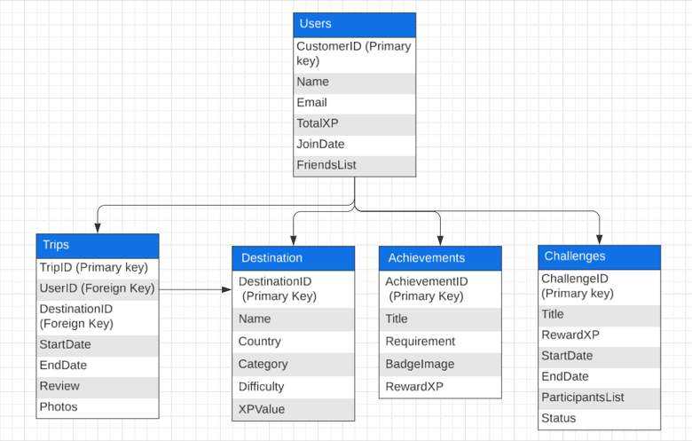

# Gamified Travel Management Database System

## Project Overview

Designed and documented a scalable database-driven travel management platform that combines travel planning, trip tracking, and gamification features to increase user engagement and long-term platform participation.

The system allows users to create travel bucket lists, log completed trips, earn achievements, participate in challenges, and compete on leaderboards while maintaining strong performance, scalability, and security standards.

---

## Business Problem

Traditional travel planning applications often struggle to maintain user engagement after initial use.

The objective of this project was to design a database solution that:

* Encourages continued user participation through gamification
* Supports personalized travel planning and progress tracking
* Promotes community interaction and friendly competition
* Maintains data security and privacy
* Supports future platform growth and scalability

---

## Project Objectives

### User Engagement

Increase user interaction through:

* Experience Points (XP)
* Achievements & Badges
* Leaderboards
* Travel Challenges

### Personalization

Enable users to:

* Create travel bucket lists
* Track completed trips
* Monitor personal achievements
* Earn rewards based on activity

### Scalability

Design a database architecture capable of supporting a growing user base and increasing transaction volumes without sacrificing performance.

---

## Key Features

### Gamification System

* XP Reward System
* Achievement Tracking
* Badge Unlocks
* Competitive Leaderboards
* Time-Limited Challenges

### Travel Management

* Travel Bucket Lists
* Destination Database
* Trip Logging
* Travel Reviews
* Photo Storage

### Community Features

* Friend System
* Shared Challenges
* Social Engagement

---

## Database Design

### Entity Relationship Model

Designed a normalized relational database using Third Normal Form (3NF) principles to reduce redundancy and improve data integrity.

Core entities include:

* Users
* Destinations
* Trips
* Achievements
* Challenges

### Design Principles

* Data Integrity
* Scalability
* Reduced Redundancy
* Efficient Query Performance
* Flexible Data Storage

---

## SQL Implementation

Implemented a complete SQL database solution including:

### Table Creation

* Users
* Destinations
* Trips
* Achievements
* Challenges

### Query Development

Created SQL queries for:

* User Progress Tracking
* Destination Analysis
* Travel Reporting
* Leaderboard Generation

### Database Objects

Developed:

* Views
* Triggers
* Stored Procedures
* Functions

### Performance Optimization

Implemented:

* Indexing
* Composite Indexes
* Query Optimization Techniques

---

## Sample Database Functionality

### Leaderboard System

Designed a ranking system that dynamically orders users based on accumulated XP.

### Achievement Rewards

Implemented stored procedures and triggers that automatically award achievements and update user progression levels.

### Travel Analytics

Created reporting queries to analyze completed trips, destinations, and user engagement.

---

## Python Data Generation

Utilized Python and the Faker library to generate realistic testing data for database validation and performance testing.

Generated:

* 1,000 User Records
* 500 Destination Records

This approach enabled realistic testing scenarios and supported scalability assessments.

---

## Security Implementation

### Access Control

Implemented role-based permissions for:

* Administrators
* Moderators
* Standard Users

### Data Privacy

Included considerations for:

* User Data Protection
* Data Encryption
* Privacy Compliance
* Secure Information Handling

### Audit Logging

Designed audit logging mechanisms to track critical database activities and support accountability.

---

## Backup & Replication Strategy

Designed a high-availability architecture incorporating:

### Backup Strategy

* Weekly Full Backups
* Daily Incremental Backups
* Encrypted Backup Storage
* Disaster Recovery Planning

### Replication Strategy

* Master-Slave Replication
* Failover Planning
* High Availability Support
* Load Distribution

---

## Performance Testing

### Optimization Techniques

* Query Refactoring
* Index Optimization
* View-Based Reporting
* Caching Strategies

### Results

* Average Query Time Under 200ms
* Support for 500 Concurrent Transactions
* Improved Leaderboard Query Performance
* Efficient High-Volume Data Processing

---

## Skills Demonstrated

### Database & SQL

* SQL Development
* Database Design
* Relational Databases
* Data Modeling
* Normalization (1NF, 2NF, 3NF)
* Query Optimization
* Views
* Triggers
* Stored Procedures

### Systems Analysis

* Requirements Analysis
* Solution Design
* Scalability Planning
* Security Design
* Performance Planning

### Development

* Python
* Faker
* Test Data Generation
* Database Testing

### Business & Technical Documentation

* Technical Documentation
* System Documentation
* Solution Architecture
* Process Design

---

## Tools & Technologies

* SQL
* MySQL
* Python
* Faker
* ER Modeling
* Database Design Principles

---

## Project Outcome

Successfully designed a scalable travel management database platform that integrates gamification principles with robust database architecture.

The project demonstrates database design, SQL development, systems analysis, performance optimization, security planning, and technical documentation skills applicable to real-world business and technology environments.
