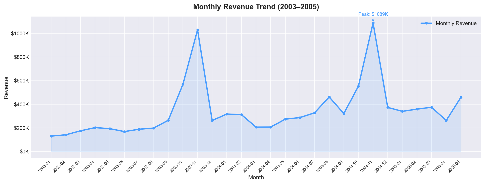
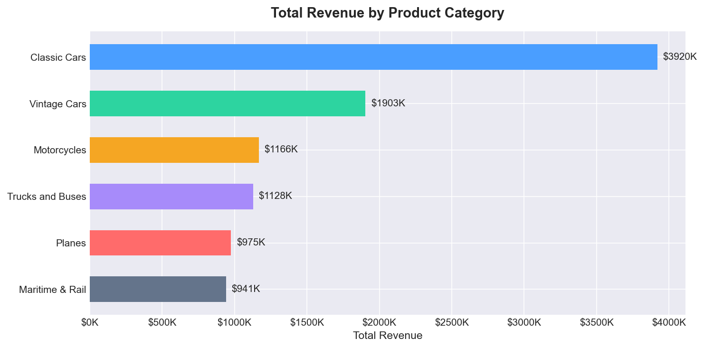
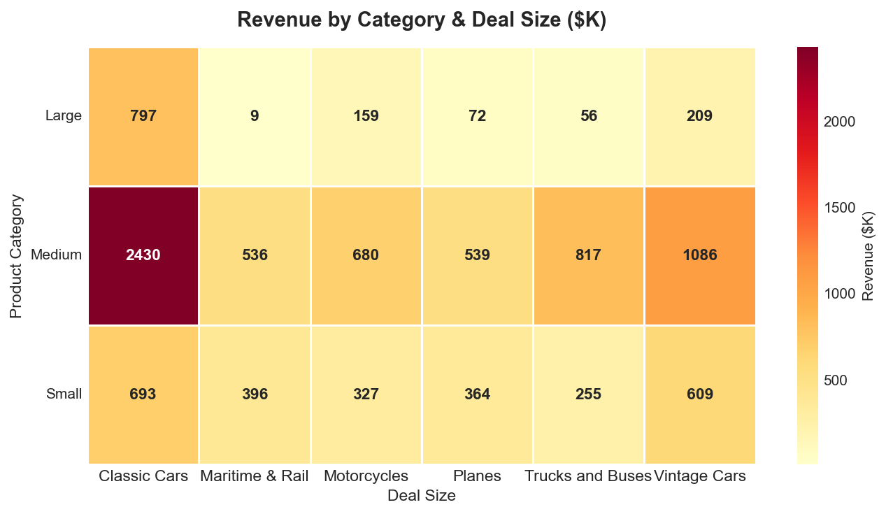

# Sales & Revenue Analytics Dashboard

## Dashboard Preview

---

## Project Overview

Developed an interactive Sales & Revenue Analytics Dashboard to evaluate business performance across product categories from 2003–2005.

The project transforms raw sales transaction data into actionable business insights through KPI reporting, trend analysis, variance reporting, and data visualization.

---

## Business Problem

Management required visibility into:

* Revenue performance over time
* Product category profitability
* Revenue contribution by deal size
* Seasonal sales trends
* Overall business performance

The objective was to support data-driven decision-making using historical sales data.

---

## Tools Used

* Microsoft Excel
* Python
* Pandas
* Matplotlib

---

## Key Metrics

| Metric               | Value        |
| -------------------- | ------------ |
| Total Revenue        | $10.03M      |
| Units Sold           | 99,067       |
| Average Margin       | 35%          |
| Top Product Category | Classic Cars |

---

## Analysis Performed

### Monthly Revenue Trend Analysis

Analyzed monthly revenue performance to identify growth patterns and seasonal revenue peaks.

---

### Product Category Analysis

Compared total revenue generated across six product categories to identify top-performing business segments.

---

### Deal Size Analysis

Evaluated revenue contribution from Small, Medium, and Large deal categories to understand sales distribution.

---

### Variance Reporting

Developed supporting variance reports to identify performance fluctuations and trends across reporting periods.

---

## Key Findings

* Classic Cars generated over $3.9M in revenue
* Revenue peaked during November 2003 and November 2004
* Medium-sized deals contributed the highest overall revenue
* Maritime & Rail generated the weakest large-deal revenue performance

---

## Business Recommendations

### Recommendation 1

Increase investment in high-performing Classic Cars product lines.

### Recommendation 2

Investigate drivers behind strong November sales performance and replicate successful sales initiatives.

### Recommendation 3

Expand medium-sized deal opportunities due to consistent revenue contribution.

### Recommendation 4

Review pricing and sales strategy for Maritime & Rail products.

---

## Skills Demonstrated

* Business Analysis
* Data Analysis
* Revenue Analysis
* KPI Reporting
* Variance Analysis
* Dashboard Development
* Data Visualization
* Business Intelligence
* Excel Analytics
* Python Analytics
